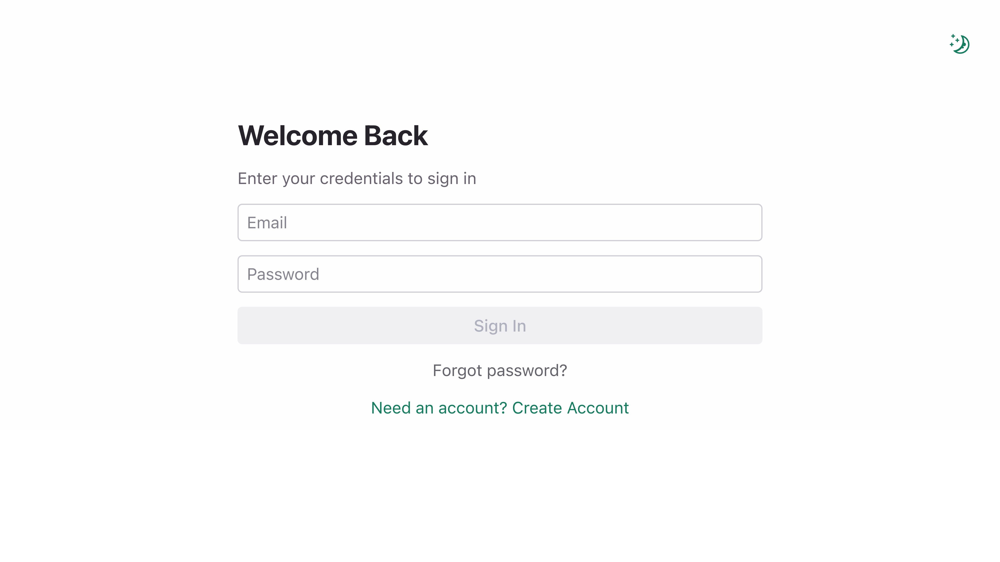

# Major Semester Project
This is my major semester project where I built a modern web application using Next.js for the first time. The project served as a learning experience in modern web development, focusing on building a full-stack application with authentication, database integration, and somewhat responsive design.

The application leverages Supabase for backend services and database management, combined with Next.js for the frontend framework. The project includes user authentication, data management, and a polished user interface built with Radix UI components.

**Live Demo**: [https://major.apps.raphaelschnell.ch/](https://major.apps.raphaelschnell.ch/)

 

## Table of Contents

- [Project Overview](#project-overview)
- [Development Journey](#development-journey)
- [Challenges and Learning Outcomes](#challenges-and-learning-outcomes)
- [Technology Stack](#technology-stack)
- [Architecture](#architecture)
- [Key Features](#key-features)
- [Known Issues](#known-issues)
- [Personal Reflections](#personal-reflections)
- [Getting Started](#getting-started)
- [License](#license)

## Project Overview
This project emerged from a desire to learn modern web development frameworks and build something meaningful from scratch. The goal was to create a full-stack web application using Next.js, which I had never worked with before in a personal project.

The application focuses on providing a smooth user experience with modern authentication flows, data management, and a clean user interface.

## Development Journey
The project started with setting up the Next.js framework and understanding its file-based routing system. Early on, I integrated Supabase for authentication and database management, which required learning how to properly configure environment variables and API connections.

One of the major milestones was transitioning from localhost development to a production environment, which involved setting up a CNAME for a cleaner domain and configuring Supabase to work with the live website instead of localhost.

The development process included researching different UI libraries, ultimately settling on Radix UI for its accessibility features, good integration with supabase and modern design components.

## Challenges and Learning Outcomes
### Next.js Learning Curve
Learning Next.js for the first time in a self-directed project was both exciting and challenging.

### Supabase Integration
Configuring Supabase to work seamlessly from localhost to production environment required understanding environment variables, database configurations, and authentication flows. The transition from local development to live deployment taught me about production considerations.

### Domain Configuration
Setting up a CNAME to make the website URL more professional was a valuable learning experience in DNS management and domain configuration.

### AI Assistance Tools
I experimented with Google CLI tools but found that GitHub Copilot was more suitable for my workflow. However, working with Copilot required learning how to provide clear instructions, as for example it sometimes suggested inline styling instead of proper CSS organization, requiring constant guidance for best practices.

### Code Organization
Learning to structure a Next.js application properly, understanding when to use global CSS versus component-specific styling, and maintaining clean code architecture was an ongoing challenge throughout the project.

## Technology Stack

### Frontend
- **Next.js 15** - React framework with client-side rendering and modern routing
- **React 19** - Latest version of React for building user interfaces
- **TypeScript** - Type-safe JavaScript for better development experience
- **Radix UI** - Accessible and customizable component library
- **CSS** - Global and component-scoped styling

### Backend & Database
- **Supabase** - Backend-as-a-Service for authentication and database
- **PostgreSQL** - Relational database (via Supabase)

### Development Tools
- **ESLint** - Code linting and formatting
- **GitHub Copilot** - AI-powered code assistance
- **Vercel** - Deployment and hosting platform

### Additional Libraries
- **Geist** - Modern font family
- **Radix Icons** - Icon library
- **Vercel Speed Insights** - Performance monitoring

## Architecture

The application follows Next.js 15's App Router architecture with:

```
src/
├── app/
│   ├── layout.tsx          # Root layout with providers
│   ├── page.tsx            # Home page
│   ├── dashboard/          # Protected dashboard routes
│   └── reset-password/     # Password reset functionality
├── components/
│   ├── AuthGuard.tsx       # Authentication protection
│   ├── ThemeProvider.tsx   # Theme management
│   └── ThemeToggle.tsx     # Dark/light mode toggle
└── lib/
    └── supabaseClient.ts   # Supabase configuration
```

The project uses:
- **Client-side rendering** with React hooks and state management
- **Client-side authentication** with Supabase Auth
- **Protected routes** with AuthGuard component
- **Theme system** with dark/light mode support

## Key Features

- **Modern Authentication System** - Secure user registration and login with Supabase Auth
- **Dark Mode Toggle** - Theme switcher located in the upper right corner for user preference
- **Clean User Interface** - Built with Radix UI components for modern design
- **Protected Routes** - Client-side route protection with AuthGuard
- **Type Safety** - Full TypeScript implementation for better code quality
- **Performance Optimized** - Next.js static generation and modern optimization techniques
- **Production Ready** - Deployed with custom domain and CNAME configuration

## Known Issues

- **Learning Curve**: Some architectural decisions were made during the learning process and could be refactored for better practices
- **Mobile Responsiveness**: The current design is not fully optimized for mobile devices and could benefit from better responsive design implementation
- **Password Reset Bug**: After using a password reset link, users may see a "faulty credentials" message even though the password reset process works correctly
- **Missing Account Deletion**: Users currently don't have the option to delete their accounts - this feature is not yet implemented

## Personal Reflections

This project represents a larger milestone in my web development journey. Building a complete application with Next.js from scratch provided invaluable hands-on experience with modern web development practices. I'm genuinely happy and proud to be able to create such a functional application using the knowledge and skills I gained during my time at FHGR.

### Key Takeaways
- **Framework Adoption**: Learning Next.js in a real project context was more effective than following tutorials alone
- **Modern Tooling**: Working with TypeScript, Radix UI, and Supabase showed the power of modern development tools
- **Production Considerations**: The experience of deploying and configuring a live website taught important lessons about environment management
- **AI Development Tools**: Understanding how to effectively use GitHub Copilot while maintaining code quality standards

This project served as a bridge between academic learning and practical application development, providing confidence to tackle larger, more complex projects in the future.

## Getting Started

To run this project locally:

1. Clone the repository
```bash
git clone [https://github.com/RapperTapper/250716_Major_Semesterprojekt_Raphael-Schnell?tab=readme-ov-file#personal-reflections]
cd 250716_Major_Semesterprojekt_Raphael-Schnell
```

2. Install dependencies
```bash
npm install
```

3. Set up environment variables
Create a `.env.local` file with your Supabase configuration:
```
NEXT_PUBLIC_SUPABASE_URL=your_supabase_url
NEXT_PUBLIC_SUPABASE_ANON_KEY=your_supabase_anon_key
```
It should work with native Supabase settings as of July 2025.

4. Run the development server
```bash
npm run dev
```

5. Open [http://localhost:3000](http://localhost:3000) in your browser

## License
This project is licensed under the MIT License. See the [LICENSE](LICENSE.txt) file for more information.